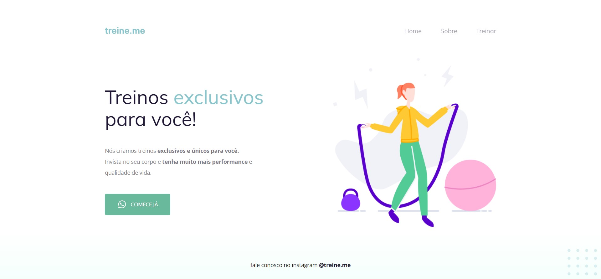

# Treine-me 🏋️‍♀️

> Trilha explorer rocketseat projeto #2

O projeto treine-me foi feito na trilha explorer da rocketseat para consolidar conhecimentos, além de aprender mais coisas na prática.

[Link para ver o projeto](https://ericodesenvolvedor.github.io/treine-me/)

## 💻 Tecnologias Utilizadas

- Figma
- HTML
- CSS